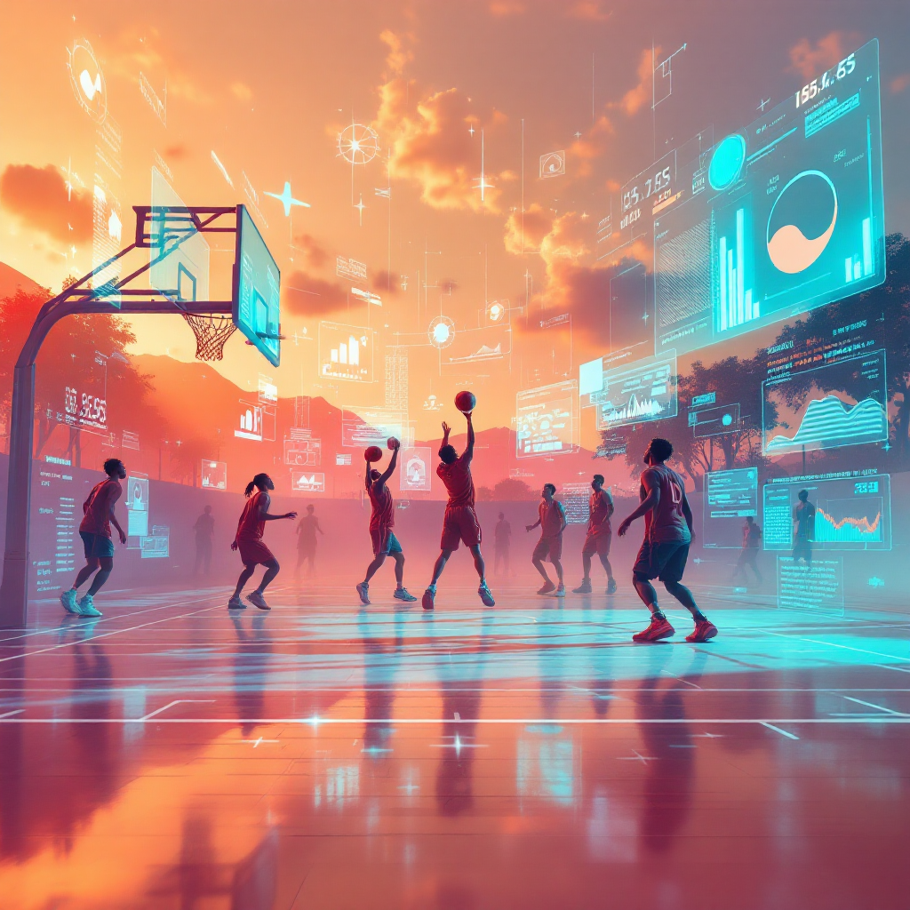

# 🏀 BAKO: Personalized AI Basketball Skill Analysis System

<br />

Welcome to the **BAKO Basketball Skill Analysis System**. This is a comprehensive, AI-powered computer vision platform designed for basketball teams and individual players to analyze game footage, track biometric shooting form, generate game analytics, and diagnose skill deficiencies in real-time.

---

## 📸 System Illustrations & Analytics

### System Galleries

| Team Analytics & Court Mapping | Player Tracking & Detections |
| :---: | :---: |
|  |  |

### Court Mapping Visualization


*(Images are dynamically pulled from the application's internal gallery and diagram assets)*

---

## ✨ Core Features

### 1. 🏅 Team Analysis Mode
- **Possession Tracking:** Captures Team A vs. Team B possession percentages.
- **Shot Analytics:** Analyzes overall team shot attempts, makes, and misses.
- **Passing & Movement:** Calculates total passes, interceptions, and overall movement patterns on the court.
- **Roster Management:** Full support for team creation, organization management, roster updates, staff invitations, and schedule tracking.

### 2. ⛹️ Personal Skill Diagnostics (Biometric Coaching)
Instead of just tracking objects, the system functions as a **Biometric Coach**:
- Breaks down shots into **4 Critical Phases**:
  - **DIP**: Analyzes knee bend angle and power generation.
  - **SET**: Analyzes elbow angle and shoulder squareness.
  - **RELEASE**: Tracks exact release height and arm extension.
  - **FINISH**: Analyzes wrist follow-through and balance stability.
- Records overall shot form consistency across longitudinal sessions.
- Measures dribble frequency, acceleration events, max speed, and total distance.

---

## 🏗️ System Architecture 

The application uses a **modern decoupled client-server architecture**, heavily relying on state-of-the-art Computer Vision algorithms on the backend and responsive declarative UI on the frontend.

1. **Frontend Client (Vite + React)**
   - Manages state dynamically via **Zustand**.
   - Handles styling using **Tailwind CSS** and **Shadcn / Radix UI** for accessible components.
   - Provides analytics visualizations via **Chart.js** and **Recharts**.
2. **Backend Engine (FastAPI + Python)**
   - Exposes RESTful endpoints.
   - Houses the core Computer Vision pipeline leveraging **OpenCV**, **Ultralytics YOLOv11**, and **Supervision**.
   - Supports heavy background processing for video frame analysis.
3. **Database & Auth (Supabase / PostgreSQL)**
   - Handles user profiles, role-based access control (Admin, Coach, Player), and row-level security (RLS).
   - Manages time-series analytics storage and relational data linking users, teams, and videos.

---

## 📂 Directory Structure

```text
Personalised-AI-Basketball-Skill-Analysis-System/
├── back-end/                     # Python / FastAPI Backend Engine
│   ├── app/                      
│   │   ├── api/                  # RESTful Route Endpoints (admin, player, etc.)
│   │   ├── core/                 # App config & security protocols
│   │   ├── models/               # Pydantic Schemas (team, analysis, players)
│   │   ├── services/             # Supabase Clients & DB interaction
│   │   └── main.py               # FastAPI entry point
│   ├── datasets/                 # YOLO Model Training Datasets (NBL versions)
│   ├── images/                   # Diagrammatic asset storage
│   ├── requirements.txt          # Python dependencies
│   ├── start_server.sh           # Backend orchestrator script
│   └── supabase_schema.sql       # Live Database SQL Migrations
│
├── front-end/                    # React / Vite Frontend Application
│   ├── public/                   # Static assets & Gallery images
│   ├── src/
│   │   ├── components/           # Reusable UI Blocks (Shadcn forms, modals, charts)
│   │   ├── context/              # Local Auth / Theme React Contexts
│   │   ├── layouts/              # Core Navigation Layout Wrappers
│   │   ├── pages/                # High-level Views (Dashboard, Settings, Analytics)
│   │   ├── services/             # Axios API integration wrappers
│   │   ├── styles/               # Global CSS files
│   │   └── main.jsx              # React mounting point
│   ├── package.json              # Node dependencies
│   └── tailwind.config.js        # Design System configurations
│
├── SKILL_DIAGNOSTIC_DESIGN.md    # Internal biometric logic documentation
└── README.md                     # Project overview (this file)
```

---

## 💻 Technology Stack

### Frontend
* **Core**: React 18, Vite, React Router DOM
* **Styling**: Tailwind CSS, PostCSS, Framer Motion (for animations)
* **Components**: Radix UI (Headless UI logic), Lucide-React (Icons)
* **Data Visualization**: Chart.js, Recharts
* **State Management**: Zustand
* **Form Handling**: React-hook-form

### Backend
* **Core**: Python 3.13, FastAPI, Uvicorn (ASGI Server)
* **Computer Vision / ML**: Ultralytics (YOLOv11), OpenCV-Python, Roboflow, Supervision, PyTorch
* **Data Handling**: Pandas, NumPy
* **Validation**: Pydantic

### Database & Infrastructure
* **PostgreSQL / Supabase**: Managed database handling UUID linking, JSONB metrics, and Row Level Security.
* **Storage**: Supabase Storage Buckets for massive video files.

---

## 📊 Database Schema Highlights

The system inherently tracks granular details to ensure safe and accurate data:
* **Videos & Detections**: Every `video` is broken down frame-by-frame in the `detections` table containing bounding boxes (`[x1, y1, x2, y2]`), keypoints, confidence metrics, and ball-association data.
* **Organizations**: Stores deeply customizable team themes, limits (e.g. `maxFouls`), and scheduling settings.
* **RLS Policies**: Heavily isolates data so a Coach can see all analytics for their Team Org, while arbitrary players can only view their `PersonalAnalysisResult` metrics.

---

## 🚀 Getting Started

To spin up the ecosystem locally, open two terminals.

### 1. Launch the Backend
```bash
cd back-end
# Recommended: Create a virtual environment first
pip install -r requirements.txt
./start_server.sh
```
*The backend server will run on `http://localhost:8000`.*

### 2. Launch the Frontend
```bash
cd front-end
npm install
npm run dev
```
*The frontend will launch via Vite, typically available at `http://localhost:5173`.*

> **Note:** Ensure your Supabase keys and API URLs are appropriately hooked into your `.env` files in both directories before uploading videos for tracking!
